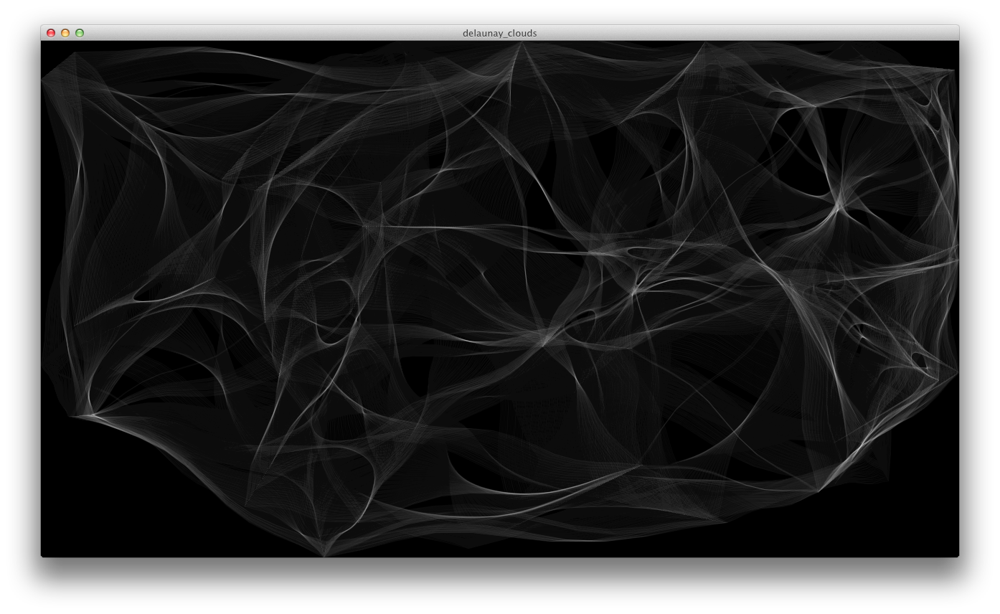

## delaunay_clouds

Nuvens geradas por arte generativa através do cálculo delaunay. Nada mais que um port para o Processing  [deste experimento feito em openFrameworks](http://www.mazbox.com/node/40). Requer a biblioteca [mesh](www.leebyron.com/else/mesh/) instalada.

