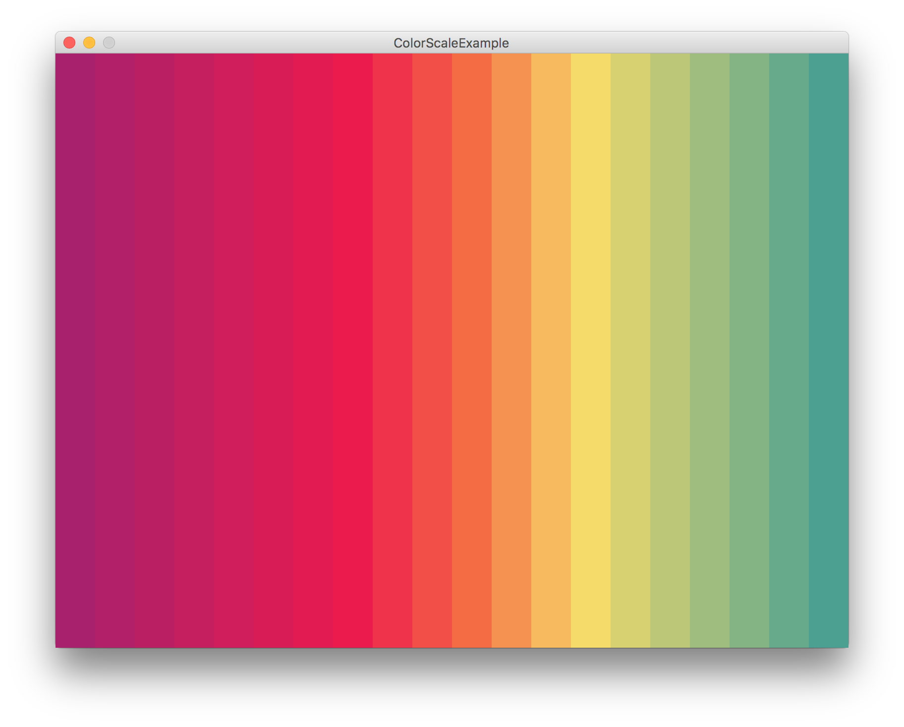

# ColorScale

The helper class `ColorScale.pde` calculates gradient between colors.

#### Usage

Create new scale before setup:

    ColorScale scale = new ColorScale();

Add the palette colors inside setup. Scores defines larger intervals for colors:

    // ColorScale.addColor(color c, int score)
    
    scale.addColor(color(168,  33, 108), 100);
    scale.addColor(color(237,  27,  77),  50);
    scale.addColor(color(243, 108,  68),  50);
    scale.addColor(color(248, 220, 105),  50);
    scale.addColor(color(46,  150, 152), 100);

Get a color giving a float between 0.0 and 1.0:

    int shades = 20;
    float w = (width * 1.0 / shades);
    
    for(int i = 0; i < shades; i++){
      float x = i * w;
      fill(scale.getColorAt(i * 1.0 / shades));
      rect(x, 0, w, height);
    }
    
You can also draw a rectangle with all the palette colors:

    // ColorScale.drawRect(int x, int y, int w, int h)
    
    if(mousePressed){
      scale.drawRect(0, height / 2 - 50, width, 100);
    }

